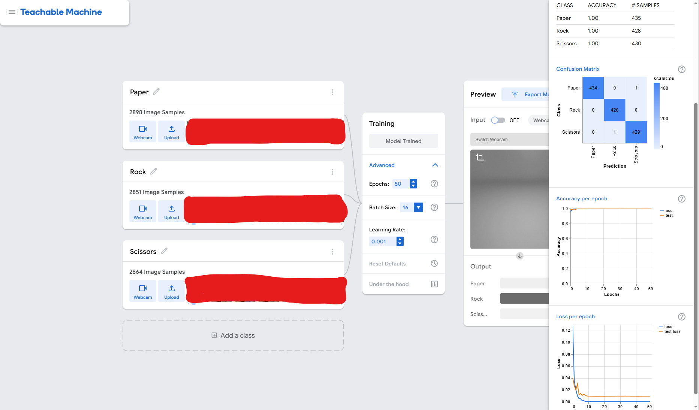

# Rock Paper Scissors - Machine Learning

## Project Description

This is the first project, part of our **Machine Learning course at Holberton School**. The goal is to build a computer vision model that can recognize **Rock, Paper, and Scissors hand gestures** from images and webcam input.

We used **Google Teachable Machine** to train and compare several models using combinations of our own collected images, the Kaggle dataset, artificially augmented images, and additional webcam images. The project focuses on exploring how different types and amounts of training data affect the model's ability to recognize hand gestures, particularly in both controlled and messy-background environments.

## Data Collection Methodology

### Variable Selection

At the beginning of the project, we considered several possible variations for the images. However, including all of them would have created too many combinations and required an impractical number of images.

Therefore, we selected three main variables that we considered relevant to the visual information available to the model:

* **Gender:** boy / girl
* **Hand side:** front / back
* **Angle:** head-on / angled left / angled right

This results in a total of:

**2 × 2 × 3 = 12 scenarios**

Other factors, such as **hand positioning and camera distance**, were also varied during data collection. However, these variations were not kept track of as separate scenarios or variables.

### Why did we include gender?

The distinction between **boy and girl** was included as a practical source of visual variation, rather than as a demographic category itself.

Visible characteristics of the hands can differ between individuals, such as **nail polish, nail length, or other hand-related features**. These characteristics can affect the pixels in an image and could potentially influence what the model learns.

By including both boys and girls, we wanted to introduce this type of visual variation and reduce the possibility that the model learns features such as painted or longer nails instead of focusing on the actual **Rock, Paper, Scissors gesture**.

### Other Untracked Variations

Several other factors varied naturally during data collection, but were not recorded as explicit variables because doing so would have created too many additional combinations.

| Variation | Notes |
| --------- | ----- |
| Hand positioning | Varied naturally between images but was not systematically recorded |
| Camera distance | Varied during image collection, affecting the apparent size of the hand |
| Background | Varied between controlled and less controlled environments |
| Lighting / contrast | Could change depending on the environment and camera conditions |

## Artificial Data Augmentation

To reduce manual data collection, the original photographs were taken using only the **right hand**.

We then used **horizontal flipping** to create left-hand examples.

We also applied artificial rotations of:

* **90°**
* **180°**
* **270°**

Starting from **216 original images**, approximately **1,728 images** were obtained after applying these transformations.

However, artificial rotations may create hand positions that are not representative of how a person would normally hold their hand in front of a camera. Therefore, we did not assume that rotations would automatically improve the model. Their effect was evaluated through model comparison.

## Model Directory Descriptions

Each directory corresponds to a model we trained using **Google Teachable Machine**.

### Models trained in stage 1

* **RPS Kaggle only** — contains images from the Kaggle dataset with a white background. The dataset originally contained **5,784 images**, but around **1,200 Rock images** were removed because the samples were not good. Additional Rock samples were collected using the webcam to help balance the classes.

* **RPS Joined** — contains our collected images together with their flipped versions, with **144 images per gesture**, including the flipped images.

* **RPS Joined - Kaggle** — contains our collected images and the Kaggle dataset, together with the corresponding flipped versions.

* **RPS Joined Artificial** — contains our collected images with artificial rotations in all directions and flipped versions, resulting in **576 images per gesture**.

* **RPS Joined Artificial - Kaggle** — contains our collected images with artificial rotations in all directions and flipped versions, together with the Kaggle dataset.

We trained all of the above models and tested them using the **live preview in Teachable Machine**. The **RPS Joined Artificial - Kaggle** model performed best overall, especially in scenarios with a white background.

However, all of the models showed weaker performance when tested with **messy backgrounds**. Because of this, we decided to collect additional webcam images so that the model could generalize better to different cameras and less controlled environments.

### Models trained in stage 2

* **RPS Joined Artificial - Kaggle - Webcam** — contains our collected images with artificial rotations in all directions and flipped versions, the Kaggle dataset, and additional webcam images collected to improve accuracy in different messy-background scenarios.

The final model contained around **2,850 images per gesture**, for a total of around **8,400 images**.

We trained the model using Teachable Machine's default setting of **50 epochs** to avoid potential overfitting.

## Data Quality and Improvement

At first, we did not notice the bad samples present in the Kaggle dataset. After identifying and removing these samples, the model performed much better, especially in **messy background scenarios**.

This led to an iterative improvement process where we first trained several models with different combinations of real, augmented, Kaggle, and webcam data, tested their performance using the Teachable Machine live preview, and then added or removed data based on the observed weaknesses.

The overall process was:

**Collect → Augment → Combine → Train → Test → Improve → Retrain**

## Results After Testing

The model comparison showed that adding artificial augmentation and the Kaggle dataset improved performance in controlled **white-background** scenarios, with **RPS Joined Artificial - Kaggle** performing best among the stage 1 models.

The statistics reported by Teachable Machine were mostly very similar across the different models. Some models had **one or two errors**, while others showed no errors in the displayed test results. These results should be interpreted with some caution, because of the way Teachable Machine performs its evaluation and because the test images were very similar to the images used to train the models. As a result, the displayed test accuracy could appear very high even when the model did not generalize as well to new, messy-background scenarios.

### Final model test statistics

The following screenshot shows the statistics for the final trained model in Teachable Machine:

The main weakness identified during testing was performance in **messy backgrounds**. To address this, webcam images were added in stage 2 to increase variation in backgrounds and camera conditions.

Removing the poor-quality Kaggle samples also produced a noticeable improvement, particularly in messy-background scenarios.
